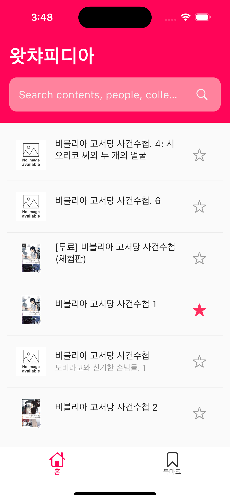
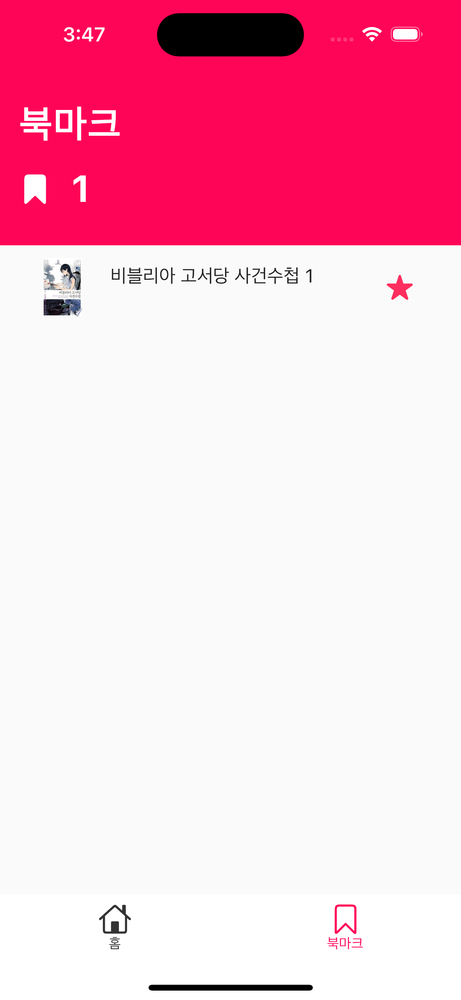

# Gatcha Pedia

- Google Book API와 JSON 모델을 활용
- `SearchBar`위젯으로 책 정보를 검색
- `IconButton` 위젯으로 북마크 
- `shared_preferences` 패키지로 북마크 데이터 저장
- 구체적인 책의 정보는 WebView 사용
- Flutter 패키지 활용
    - HTTP 통신: `dio`
    - 위젯 상태 관리: `provider`
    - 로컬데이터 관리: `shared_preferences`
    - 웹페이지 프리뷰: `webview_flutter (3.0.4)`

## Snapshots

	
	
	

